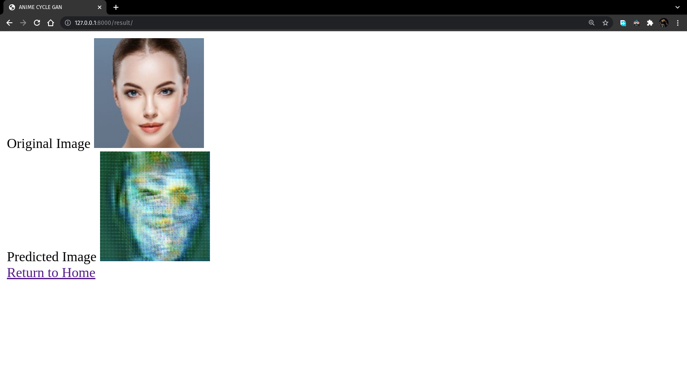

## Anime to Real Life images

Used a CycleGAN model to try to convert anime characters to "real life" and vice versa. Trained the model for 45 epochs with an image size of 128x128, on Kaggle. The results are as follows:

Then made a website using django to make the whole converting process, as flawless as it can be.

